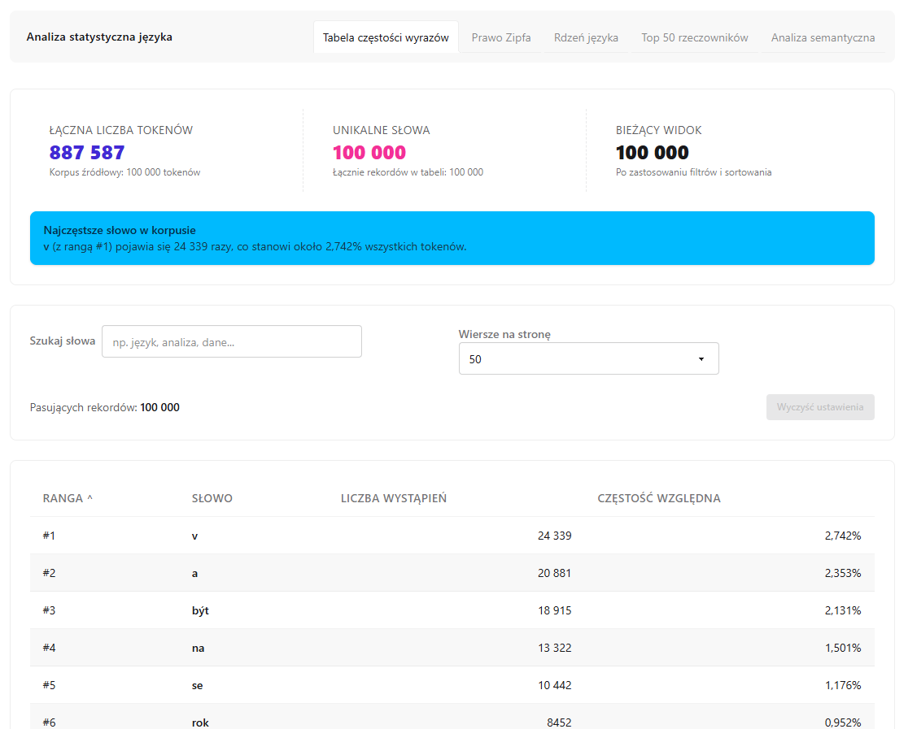
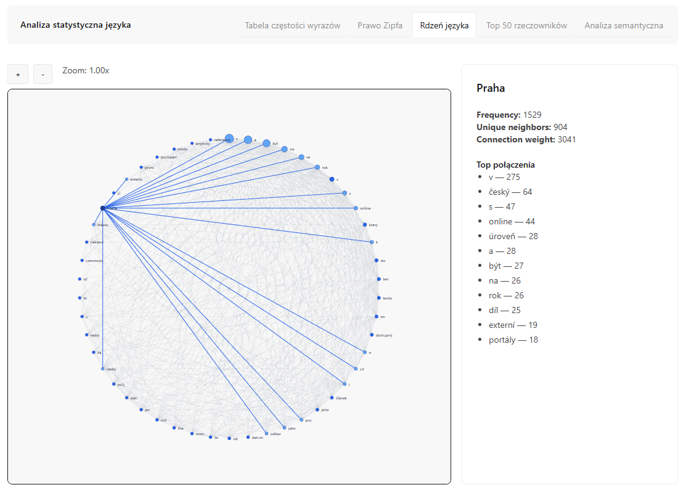
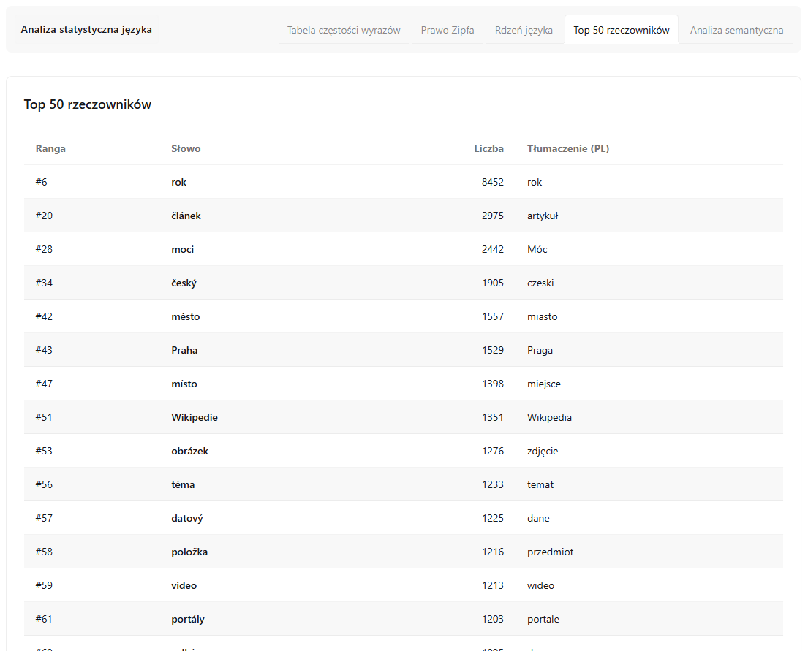
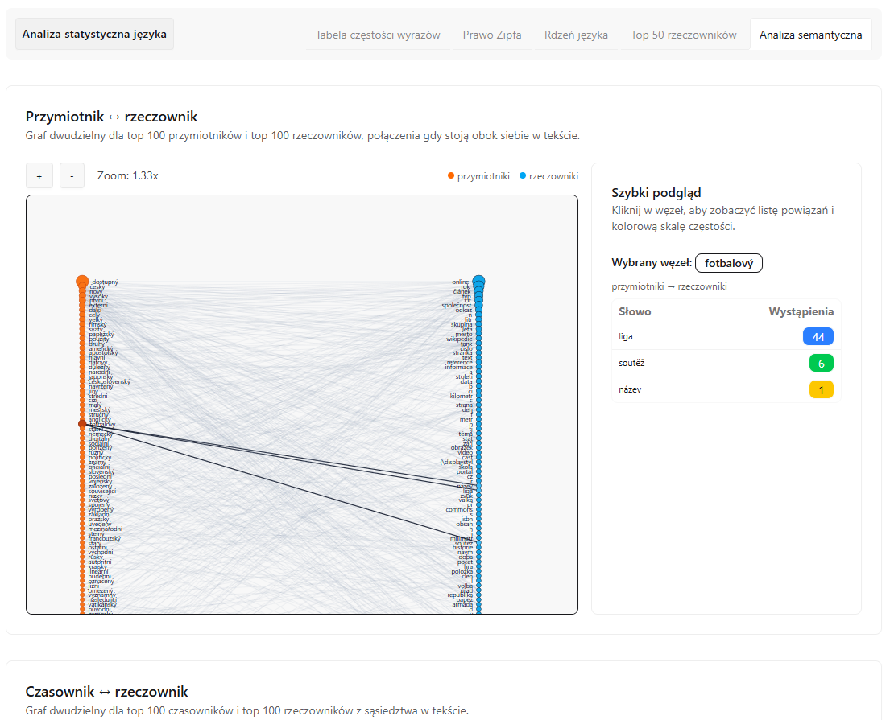

# Projekt PJN — Analiza językowa

Projekt demonstracyjny do analizy korpusowej i wizualizacji metryk językowych.

## Krótki opis

- Backend: narzędzia przetwarzania korpusu, ekstrakcja rzeczowników, analiza częstości i metryk Zipfa.
- Frontend: interaktywne UI zbudowane w React + Vite, prezentujące tabele, wykresy i graf rdzenia językowego.

## Co robi projekt

Analizuje korpus językowy, wylicza częstotliwości słów, liczy metryki Zipfa oraz buduje graf „language core”, a następnie udostępnia wyniki w interfejsie webowym z tabelami i wykresami.


    

## Główne foldery

- [apps/backend](apps/backend): kod przetwarzania danych i analizy (zobacz README tamże).
- [apps/frontend](apps/frontend): aplikacja kliencka (React + Vite + Tailwind/DaisyUI).
- [img](img): grafiki używane w README i w interfejsie.

## Pliki danych w frontendzie

- Statyczne dane używane przez UI znajdują się w [apps/frontend/src/data](apps/frontend/src/data).

## Uruchomienie frontendu (lokalnie)

1. Wejdź do katalogu frontendu:

```bash
cd apps/frontend
```

2. Zainstaluj zależności:

```bash
npm install
```

3. Uruchom środowisko deweloperskie:

```bash
npm run dev
```

Domyślnie Vite udostępnia aplikację pod adresem http://localhost:5173 — otwórz tę stronę w przeglądarce.

4. (Opcjonalnie) Zbuduj i podglądaj produkcyjną wersję:

```bash
npm run build
npm run preview
```

Jeżeli używasz `pnpm` lub `yarn`, zastąp odpowiednio krok instalacji poleceniem `pnpm install` lub `yarn`.

Jeżeli potrzebujesz, mogę dodać skrypt uruchamiający backend lub przykładowe dane do szybkiego startu.
