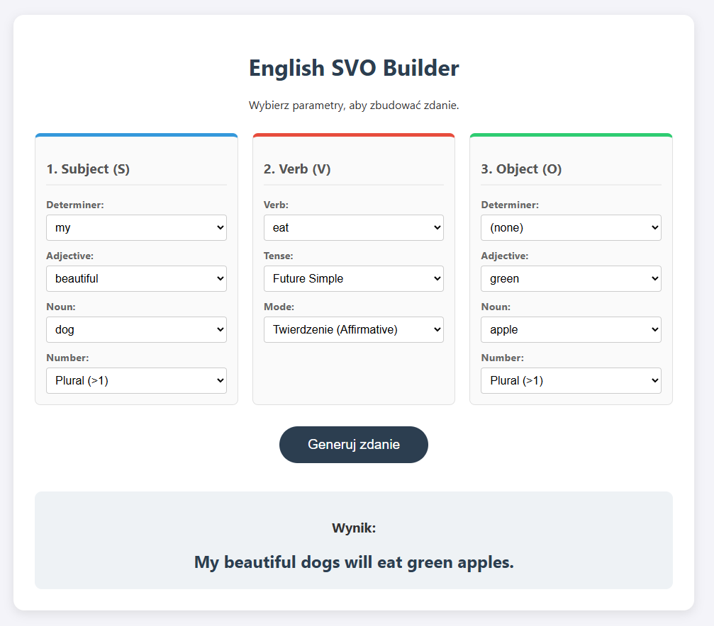

# Projekt 2 (PJN) - Generator zdań

Prosta aplikacja webowa oparta o Flask, która generuje angielskie zdania w różnych czasach i trybach na podstawie wybranych elementów (podmiot, czasownik, dopełnienie).



## O aplikacji

Aplikacja pozwala składać poprawne zdania po angielsku, łącząc podmiot, czasownik i dopełnienie, a następnie odmieniając czasownik i dobierając rodzajniki. Wspiera podstawowe czasy i tryby, więc nadaje się do nauki gramatyki oraz szybkiego testowania przykładów.

## Wymagania

- Python 3.10+
- (opcjonalnie) GNU Make

## Szybki start

1. Utwórz środowisko i zainstaluj zależności:

```bash
make install
```

2. Uruchom aplikację:

```bash
make run
```

Serwer wystartuje lokalnie pod adresem `http://127.0.0.1:5000`.

## Uruchomienie bez Makefile

```bash
python -m venv .venv
.\.venv\Scripts\pip install -U pip
.\.venv\Scripts\pip install -e .
.\.venv\Scripts\python app.py
```

## Tryb developerski (Flask)

```bash
make dev
```

## API

### `POST /generate`

Przykładowe wywołanie:

```bash
curl -X POST http://127.0.0.1:5000/generate ^
  -H "Content-Type: application/json" ^
  -d "{\"subject_noun\":\"cat\",\"subject_number\":\"singular\",\
  \"verb\":\"eat\",\"object_noun\":\"apple\",\
  \"object_number\":\"singular\",\"tense\":\"present\",\
  \"mode\":\"affirmative\"}"
```

Odpowiedź:

```json
{"sentence":"The cat eats an apple."}
```

## Struktura projektu

- `app.py` - główna aplikacja Flask i routing
- `engine.py` - logika składania zdania i odmiany czasowników
- `data.py` - dane wejściowe (czasowniki, rzeczowniki, przymiotniki)
- `templates/` - szablony HTML
- `static/` - CSS i JS

## Dostępne cele Makefile

- `make install` - tworzy venv i instaluje zależności
- `make run` - uruchamia aplikację
- `make dev` - uruchamia serwer developerski Flask
- `make clean` - usuwa środowisko wirtualne
